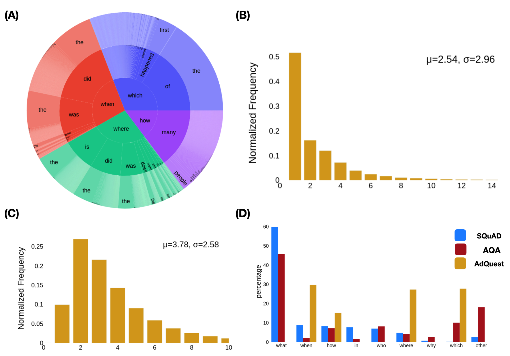

# AdQuest-Synthetic-Adversarial-Dataset-for-QA-Models

Welcome to our GitHub repository focused on enhancing the robustness of NLP models in question answering, specifically examining the ELECTRA_{Small} model. Our research delves into how these advanced models perform against adversarial datasets, a significant challenge due to their traditional training on static datasets like SQuAD. This conventional training approach leaves them vulnerable to adversarial attacks, as they tend to learn dataset-specific artifacts. We critically evaluate the ELECTRASmall model's performance, not only on the standard SQuAD1.1 dataset but also on a variety of adversarial datasets derived from it, uncovering its susceptibility to such attacks.

In response to these challenges, we have developed and tested a novel strategy: training the ELECTRASmall model on a composite dataset that includes both SQuAD1.1 and adversarial examples. A major part of our study is the creation of AdQuest, a synthetic adversarial dataset generated using the RoBERTa language model. This innovative dataset is crafted to improve the model's performance on both adversarial and standard datasets, demonstrating the effectiveness of using targeted, synthetically generated adversarial data to significantly bolster model resilience. Our repository offers insights into our research findings, methods, and resources, including the AdQuest dataset, inviting collaboration and further exploration from the NLP community.

This research was part of the final project at University of Texas at Austin NLP Graduate Course. 

## Create conda environment

To create the codna environment:

`conda env export --no-builds > environment.yml`

Activate the conda environment:

`conda activate electra_adverse`

## ELECTRA-Small baseline model fine-tuning

The project was developed in three stages. In the first stage, the baseline ELECTRA-Small model was fine-tuned on SQuAD 1.1 dataset. Following the fine-tuning the model was evaluated on AdversarialQA dataset. This evaluation revealed the vulnerabilities of the model with dataset artifacts.  

## Synthetic adversarial dataset generation

In order to develop a robust QA model, the model needs to be fine-tuned on adversarial datasets. However, generating such adversarial datasets are resource intensive and time-consuming. Therefore, I used the synthetic adversarial dataset generation pipeline developed by Bartolo et. al. 

For this purpose, we follow the instructures provided in https://github.com/maxbartolo/synQA-question-generators

## Fine-tuning ELECTRA-Small with Adversarial dataset

In this project, we focussed on Questions beginning with 'when', 'which', 'how long' and 'where' question words. Here, I explored specifically the temporal, spatial, numerical and implicit question comprehension types. 

The example fine-tuning scripts are provided in models directory.
